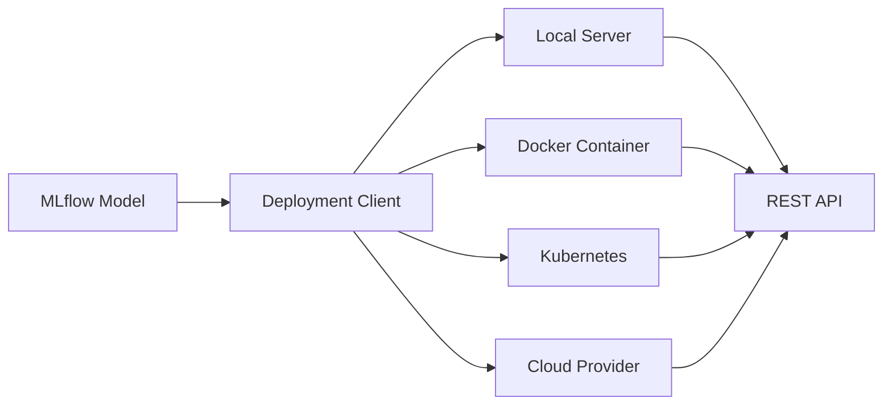

MLflow provides multiple deployment options to serve your trained models in production environments. Choose the deployment strategy that best fits your infrastructure and requirements.

## Deployment Options

MLflow supports several deployment targets, each suited for different use cases:

<CardGroup cols={2}>
  <Card title="Local Deployment" icon="laptop" href="/deployment/local">
    Serve models locally for development and testing
  </Card>
  <Card title="Docker Containers" icon="docker" href="/deployment/docker">
    Package models in Docker containers for portability
  </Card>
  <Card title="Kubernetes" icon="dharmachakra" href="/deployment/kubernetes">
    Deploy to Kubernetes clusters for scalable production workloads
  </Card>
  <Card title="Cloud Providers" icon="cloud" href="/deployment/cloud-providers">
    Deploy to AWS SageMaker, Azure ML, and Google Cloud Platform
  </Card>
</CardGroup>

## Deployment Architecture

MLflow's deployment architecture consists of several components:



### Core Components

<AccordionGroup>
  <Accordion title="BaseDeploymentClient">
    The base class for all deployment clients. Plugin implementors extend this class to create custom deployment targets.

    **Key Methods:**
    - `create_deployment()` - Deploy a model to the target
    - `update_deployment()` - Update an existing deployment
    - `delete_deployment()` - Remove a deployment
    - `list_deployments()` - List all deployments
    - `predict()` - Make predictions using the deployment
  </Accordion>

  <Accordion title="Model Serving">
    MLflow models can be served via:
    - **Python Function (PyFunc)** - Standard serving interface
    - **MLServer** - Advanced serving with Seldon Core integration
    - **Custom Containers** - Build your own serving infrastructure
  </Accordion>

  <Accordion title="Deployment Plugins">
    Extend MLflow deployment capabilities through plugins:
    - Community plugins for various platforms
    - Custom plugins for proprietary infrastructure
    - Plugin discovery via entry points
  </Accordion>
</AccordionGroup>

## Deployment Workflow

<Steps>
  <Step title="Train and Log Model">
    Train your model and log it to MLflow tracking server:
    ```python
    import mlflow
    
    with mlflow.start_run():
        # Train model
        model = train_model()
        
        # Log model
        mlflow.sklearn.log_model(model, "model")
    ```
  </Step>

  <Step title="Choose Deployment Target">
    Select the appropriate deployment target based on:
    - Infrastructure requirements
    - Scaling needs
    - Latency requirements
    - Cost constraints
  </Step>

  <Step title="Deploy Model">
    Use MLflow CLI or Python API to deploy:
    ```bash
    # Using CLI
    mlflow deployments create -t <target> -n <name> -m <model-uri>
    
    # Using Python API
    from mlflow.deployments import get_deploy_client
    client = get_deploy_client("<target>")
    client.create_deployment("<name>", "<model-uri>")
    ```
  </Step>

  <Step title="Make Predictions">
    Send prediction requests to your deployed model:
    ```python
    import pandas as pd
    from mlflow.deployments import get_deploy_client
    
    client = get_deploy_client("<target>")
    predictions = client.predict("<deployment-name>", data)
    ```
  </Step>
</Steps>

## Deployment Commands

MLflow provides a comprehensive CLI for managing deployments:

### Create Deployment

```bash
mlflow deployments create \
  --target <target-uri> \
  --name <deployment-name> \
  --model-uri <model-uri> \
  --flavor <flavor> \
  -C key=value
```

### Update Deployment

```bash
mlflow deployments update \
  --target <target-uri> \
  --name <deployment-name> \
  --model-uri <new-model-uri>
```

### Delete Deployment

```bash
mlflow deployments delete \
  --target <target-uri> \
  --name <deployment-name>
```

### List Deployments

```bash
mlflow deployments list --target <target-uri>
```

### Get Deployment Details

```bash
mlflow deployments get \
  --target <target-uri> \
  --name <deployment-name>
```

### Make Predictions

```bash
mlflow deployments predict \
  --target <target-uri> \
  --name <deployment-name> \
  --input-path input.json \
  --output-path output.json
```

## Python API

Use the Python API for programmatic deployment management:

```python
from mlflow.deployments import get_deploy_client

# Initialize deployment client
client = get_deploy_client("http://localhost:5000")

# Create deployment
deployment = client.create_deployment(
    name="my-deployment",
    model_uri="models:/my-model/production",
    config={"memory": "2Gi", "cpu": "1000m"}
)

# Make predictions
import pandas as pd
data = pd.DataFrame({"feature1": [1, 2, 3], "feature2": [4, 5, 6]})
predictions = client.predict(deployment_name="my-deployment", inputs=data)

# Update deployment
client.update_deployment(
    name="my-deployment",
    model_uri="models:/my-model/production",
    config={"memory": "4Gi"}
)

# List all deployments
deployments = client.list_deployments()
for deployment in deployments:
    print(f"Deployment: {deployment['name']}")

# Delete deployment
client.delete_deployment(name="my-deployment")
```

## Endpoint Management

Some deployment targets support endpoint management for organizing deployments:

```python
# Create endpoint
endpoint = client.create_endpoint(
    name="production-endpoint",
    config={"region": "us-west-2"}
)

# Create deployment in endpoint
deployment = client.create_deployment(
    name="my-model-v1",
    model_uri="models:/my-model/1",
    endpoint="production-endpoint"
)

# List endpoints
endpoints = client.list_endpoints()

# Delete endpoint
client.delete_endpoint(endpoint="production-endpoint")
```

## Supported Deployment Flavors

MLflow supports deploying models with the following flavors:

<Tabs>
  <Tab title="PyFunc">
    Universal Python function interface for all model types:
    ```python
    mlflow.pyfunc.log_model("model", python_model=my_model)
    ```
  </Tab>
  <Tab title="Scikit-learn">
    Native scikit-learn model deployment:
    ```python
    mlflow.sklearn.log_model(sk_model, "model")
    ```
  </Tab>
  <Tab title="TensorFlow">
    TensorFlow and Keras models:
    ```python
    mlflow.tensorflow.log_model(tf_model, "model")
    ```
  </Tab>
  <Tab title="PyTorch">
    PyTorch model deployment:
    ```python
    mlflow.pytorch.log_model(pytorch_model, "model")
    ```
  </Tab>
</Tabs>

## Input Data Formats

MLflow serving endpoints accept multiple input formats:

### Pandas DataFrame (Split Format)

```bash
curl http://localhost:5000/invocations -H 'Content-Type: application/json' -d '{
  "dataframe_split": {
    "columns": ["feature1", "feature2"],
    "data": [[1, 2], [3, 4]]
  }
}'
```

### Pandas DataFrame (Records Format)

```bash
curl http://localhost:5000/invocations -H 'Content-Type: application/json' -d '{
  "dataframe_records": [
    {"feature1": 1, "feature2": 2},
    {"feature1": 3, "feature2": 4}
  ]
}'
```

### Tensor Input

```bash
curl http://localhost:5000/invocations -H 'Content-Type: application/json' -d '{
  "inputs": [[1, 2], [3, 4]]
}'
```

### Instances Format

```bash
curl http://localhost:5000/invocations -H 'Content-Type: application/json' -d '{
  "instances": [
    {"feature1": 1, "feature2": 2},
    {"feature1": 3, "feature2": 4}
  ]
}'
```

## Deployment Best Practices

<CardGroup cols={2}>
  <Card title="Version Control" icon="code-branch">
    Always version your models and track deployment history
  </Card>
  <Card title="Resource Limits" icon="gauge">
    Set appropriate CPU and memory limits for deployments
  </Card>
  <Card title="Health Checks" icon="heart-pulse">
    Implement health check endpoints for monitoring
  </Card>
  <Card title="Auto-scaling" icon="arrow-up-right-dots">
    Configure auto-scaling based on traffic patterns
  </Card>
  <Card title="Security" icon="shield">
    Use authentication and encryption for production deployments
  </Card>
  <Card title="Monitoring" icon="chart-line">
    Monitor prediction latency, throughput, and model performance
  </Card>
</CardGroup>

## Environment Variables

Common environment variables for deployment:

| Variable | Description |
|----------|-------------|
| `MLFLOW_TRACKING_URI` | MLflow tracking server URI |
| `MLFLOW_DEPLOYMENT_FLAVOR_NAME` | Default flavor for deployment |
| `MLFLOW_SAGEMAKER_DEPLOY_IMG_URL` | SageMaker deployment image URL |
| `MLFLOW_DISABLE_ENV_CREATION` | Disable environment creation at runtime |
| `ENABLE_MLSERVER` | Enable MLServer for serving |

## Next Steps

<CardGroup cols={2}>
  <Card title="Local Deployment" icon="laptop" href="/deployment/local">
    Learn how to deploy models locally for testing
  </Card>
  <Card title="Docker Deployment" icon="docker" href="/deployment/docker">
    Package models in Docker containers
  </Card>
  <Card title="Kubernetes" icon="dharmachakra" href="/deployment/kubernetes">
    Deploy to Kubernetes for production
  </Card>
  <Card title="Cloud Providers" icon="cloud" href="/deployment/cloud-providers">
    Deploy to AWS, Azure, or GCP
  </Card>
</CardGroup>
